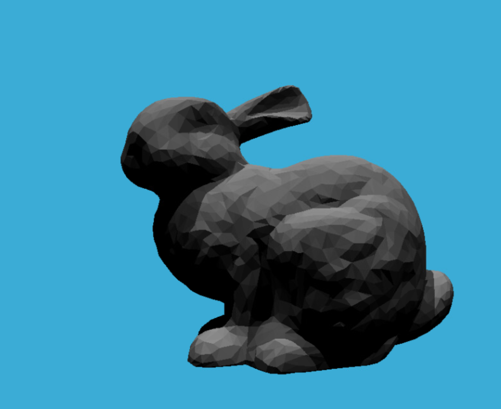
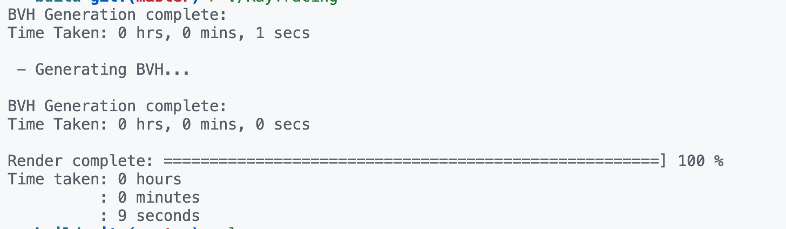
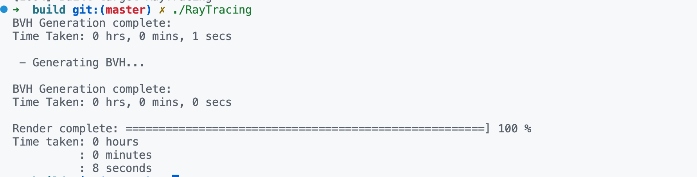

# Assignment 6: Ray Tracing

## Finished tasks
- [x] compile and run the code
- [x] implement intersection of ray and bounding box
- [x] implement BVH construction
- [x] implement SVH construction


## Result of ray tracing

## Functions

###  intersection of ray and bounding box
using vector calculation to calculate the intersection of ray and bounding box
```cpp
inline bool Bounds3::IntersectP(const Ray& ray, const Vector3f& invDir,
                                const std::array<int, 3>& dirIsNeg) const
{
    auto oMin = pMin - ray.origin;
    auto oMax = pMax - ray.origin;    

    auto tMin = oMin * invDir;
    auto tMax = oMax * invDir;

    for (int i = 0; i < 3; ++i) {
        if (dirIsNeg[i]) {
            std::swap(tMin[i], tMax[i]);
        }
    }
    
    float tEnter = std::max(tMin[0], std::max(tMin[1], tMin[2]));
    float tExit = std::min(tMax[0], std::min(tMax[1], tMax[2]));

    return tExit >=0 && tEnter <= tExit;
}
```

### BVH algorithm
first check if the ray hits the bounding box of the node, if not, return an empty intersection. If the node is a leaf node, return the intersection of the object. Otherwise, recursively check the left and right child nodes and return the intersection with the smaller distance.
```cpp
Intersection BVHAccel::getIntersection(BVHBuildNode* node, const Ray& ray) const
{
    Intersection inter;

    std::array<int, 3> dirIsNeg;
    for (int i = 0; i < 3; ++i) {
        dirIsNeg[i] = ray.direction[i] < 0;
    }
    if (!node->bounds.IntersectP(ray, ray.direction_inv, dirIsNeg)) {
        return inter;
    }

    if (node->left == nullptr && node->right == nullptr) {
        return node->object->getIntersection(ray);
    }

    auto hitLeft = getIntersection(node->left, ray);
    auto hitRight = getIntersection(node->right, ray);
    return hitLeft.distance < hitRight.distance ? hitLeft : hitRight;
}
```

### SAH algorithm
$C = C_{inter} + P_BC_B+P_BC_B$

$P_B = \frac{S_A}{S_N}, P_B=\frac{S_B}{S_N}$

I implemented the SVH algorithm in the following way:
```
for each axis:
    sort the objects by coordinates
    choose bucket count B = min(16, size of objects - 1)
    append each object to the corresponding bucket
    for each bucket:
        split the objets into two groups
        calculate the cost of the split
        upd best cost
use best cost to split the objects

```

## Performance
naive: build 1s, render 9s


SVH: build 1s, render 8s
